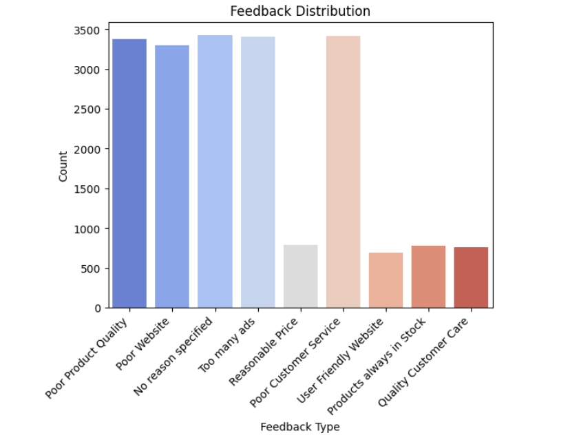

# 📊 Churn Analysis Project

## 🎯 Objective
This project analyzes customer churn data to identify patterns in demographics, membership categories, wallet points, login behavior, and feedback.  
The goal is to preprocess the dataset, visualize customer feedback, and build a machine learning model to predict churn‑related feedback.

---

## 🧰 Tools & Libraries
- Python 3.x
- NumPy
- Pandas
- Matplotlib
- Seaborn
- Scikit‑learn

---

## 📁 Dataset
- File: `Churn.csv`
- Rows: 19,919
- Columns: 24  
- Key features:
  - `age`, `gender`, `region_category`, `membership_category`
  - `avg_time_spent`, `avg_transaction_value`, `points_in_wallet`
  - `feedback` (target variable)

---

## ⚙️ Steps Performed
1. **Data Exploration**
   - Checked missing values and summary statistics.
   - Identified anomalies (e.g., negative values in `days_since_last_login`).

2. **Data Cleaning**
   - Filled missing values with median or placeholder strings.
   - Converted categorical columns using `LabelEncoder`.
   - Converted numeric columns (`points_in_wallet`, `avg_frequency_login_days`) to proper types.

3. **Visualization**
   - Plotted distribution of `feedback` using Seaborn.
   - Insights: Most frequent feedback categories were *Poor Customer Service*, *Too many ads*, *Poor Product Quality*, *Poor Website*.

4. **Model Building**
   - Features: All columns except identifiers and `feedback`.
   - Target: `feedback`.
   - Split dataset into train (80%) and test (20%).
   - Trained a **Random Forest Classifier**.

5. **Evaluation**
   - Accuracy achieved: **19%** (baseline model, scope for improvement).

---

## 📸 Sample Output
### Feedback Distribution


---

## 🚀 How to Run
1. Clone the repository:
   ```bash
   git clone https://github.com/Akshaya2472006/Churn-Analysis.git


Akshaya  
BCA
Student at Kamaraj College
